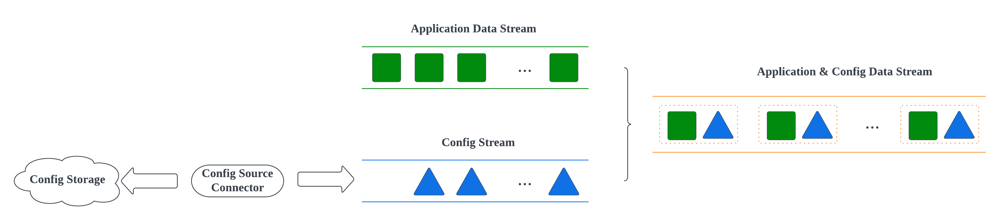

# Apache Flink Dynamic Config
[]([code_of_conduct.md](https://www.contributor-covenant.org/version/2/1/code_of_conduct/))

This project is to provide an easy-to-use and general-purpose way to overcome the problem about how to update configs dynamically for a running [Apache Flink](https://flink.apache.org/) job without stopping it. It exposes a simple interface and hides the complex streaming handling logic to enable the same as 
suggested by [Apache Broadcast Pattern](https://flink.apache.org/2019/06/26/a-practical-guide-to-broadcast-state-in-apache-flink/).

A Java library will be provided to be integrated with the client flink job. The library will create a broadcast stream to carry the config events with config details in it. A polling based HTTP source connector provided in the library to periodically
pull the latest configs from a configurable endpoint of the external config source. The config source **is not part of** the library. It is in client side which is to provide config with the format defined in the below part by the library.

The library will connect the config broadcast stream with the application data stream to emit a
stream with the pair of application event and config. In this way, the config will be reachable by the application stream within this new connected
stream.

The overall flow will be like below:


## Building
```sh
mvn clean install -DskipTests
```

## How to use
1. Import as a maven dependency
```xml
<dependency>
   <groupId>com.ebay.streaming</groupId>
   <artifactId>flink-dynamic-config</artifactId>
   <version>${version}</version>
</dependency>
```
2. Define a Java POJO class to represent config, e.g. class Playground below:
```java
public class Playground {
    private Integer number;

    private String name;
   
    private Long totalOpenCount;

    private Boolean internalOnly;

    private List<String> admins;
}
```
We assume the content of config are set of key-value pairs. The field names in the above class are the key and the values for the fields are 
the config values. So far we support the below types of the value:
| Type         | Java      |
| :----:       |:----:     |
| INT32        | Integer   |
| INT64        | Long      |
| STRING       | String    |
| BOOL         | Boolean   |
| Collection   | List      |

**The item type in the Collection is within the scopes of Integer, Long, String, Boolean.**

The format of the config from the config source connector is expected to be a JSON with key-value and value is in String format.
An example of the corresponding config for the above Playground class could be like below:
```json
{
    "internalOnly": "true",
    "number": "1",
    "totalOpenCount": "100",
    "name": "Wonderful Playground",
    "admins": [
        "Tom",
        "Jerry",
        "Mary"
    ]
}
```

3. Configure the config source stream and related settings, most of the settings are for config source connector which is
to poll the config periodically from an external config store, it could be a HTTP service with an exposed endpoint.
```java
FlinkDynamicConfigSettings<Playground> flinkGlobalConfigSettings = FlinkDynamicConfigSettings.<Playground>builder()
                .serviceName("flink-playground-java")
                .dynamicConfigPollingInterval(10)
                .dynamicConfigPollingRequestTimeout(3)
                .dynamicConfigPollingResponseTimeout(3)
                .dynamicConfigSourceType(DynamicConfigSourceType.HTTP_POLLING)
                .dynamicConfigSourceEndpoint("http://localhost:8080/v1/configs")
                .dynamicConfigClassType(Playground.class)
                .build();
```
**List of settings:**
|               Settings               |                             Note                                      |               Default  Value         |
|:------------------------------------:|:---------------------------------------------------------------------:|:------------------------------------:|
|     dynamicConfigPollingInterval     |    Polling interval for config source connector in second             |                 300                  |  
|  dynamicConfigPollingConnectTimeout  | HTTP connect timeout for config for config source connector in second |                  1                   |  
|  dynamicConfigPollingRequestTimeout  | HTTP request timeout for config for config source connector in second |                  1                   |   
| dynamicConfigPollingResponseTimeout  | HTTP response timeout for config for config source connector in second|                  1                   |
|       dynamicConfigSourceType        |                      Config source type                               | DynamicConfigSourceType.HTTP_POLLING |
|     dynamicConfigSourceEndpoint      |                    Config source endpoint                             |                  -                   |
|        dynamicConfigClassType        |                Application config class type                          |                  -                   |

4. Wire the application data stream
```java
DataStream<String> applicationSourceDataStream = ....; // Application data stream
DynamicConfigWire<String, Playground> dynamicConfigWire = new DynamicConfigWire<>(flinkGlobalConfigSettings);
applicationSourceDataStream.wire(sourceDataStream)
        .returns(TypeInformation.of(new TypeHint<Tuple2<String, Playground>>(){}))
        .addSink(...);
```

## License
[Apache 2.0](https://www.apache.org/licenses/LICENSE-2.0)

